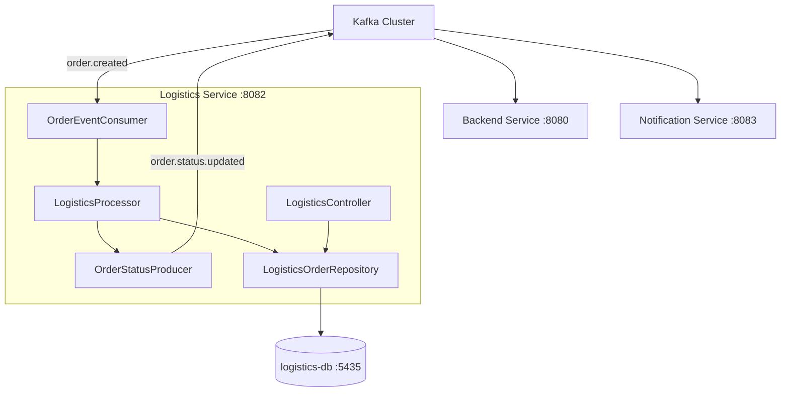
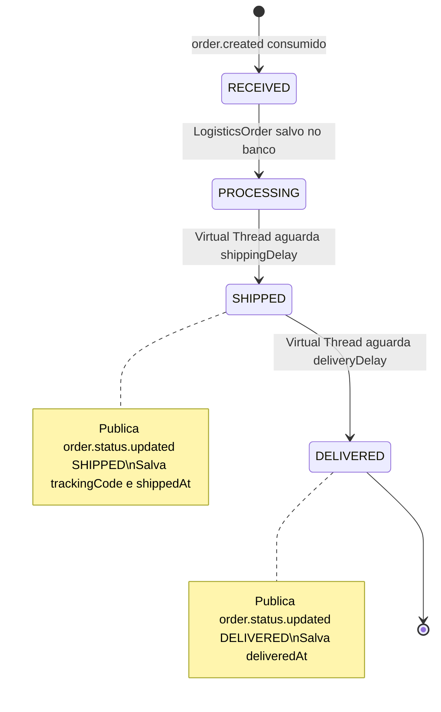

# TeeStore — Logistics Service

Microservico de logistica da plataforma TeeStore. Consome eventos `order.created` do Kafka, simula o ciclo de vida de um pedido (PROCESSING → SHIPPED → DELIVERED) usando Virtual Threads do Java 21, persiste o estado logistico em PostgreSQL e publica eventos `order.status.updated` de volta ao Kafka.

---

## Sumário

- [Responsabilidade](#responsabilidade)
- [Arquitetura](#arquitetura)
- [Tecnologias](#tecnologias)
- [Padrões de Projeto](#padrões-de-projeto)
- [Fluxo de Processamento](#fluxo-de-processamento)
- [Banco de Dados](#banco-de-dados)
- [Variáveis de Ambiente](#variáveis-de-ambiente)
- [Como Rodar](#como-rodar)
- [API — Rotas](#api--rotas)
- [Kafka — Tópicos](#kafka--tópicos)
- [Testes](#testes)

---

## Responsabilidade

Este servico é responsavel exclusivamente pelo fluxo logistico. Ele nao conhece regras de negocio do Backend e opera de forma totalmente assíncrona via mensageria.

```
Backend publica order.created
         |
         v
Logistics Service consome
         |
         +-- Salva LogisticsOrder (PROCESSING)
         |
         +-- Virtual Thread: aguarda shippingDelay (8s)
         |       |
         |       +-- Publica order.status.updated (SHIPPED)
         |
         +-- Virtual Thread: aguarda deliveryDelay (15s)
                 |
                 +-- Publica order.status.updated (DELIVERED)
```

---

## Arquitetura



---

## Tecnologias

| Camada | Tecnologia |
|---|---|
| Linguagem | Java 21 |
| Framework | Spring Boot 3.x |
| ORM | Spring Data JPA + Hibernate |
| Banco | PostgreSQL 16 |
| Migrations | Flyway |
| Mensageria | Apache Kafka 3.5 |
| Threads | Virtual Threads (Java 21) |
| Build | Maven |
| Testes | JUnit 5 + Mockito |

---

## Padrões de Projeto

**Injecao de Dependencia (DI)**
Todas as dependencias sao injetadas via construtor. O `LogisticsProcessor` recebe `LogisticsOrderRepository` e `OrderStatusProducer` explicitamente, sem `@Autowired` em campos.

```java
public LogisticsProcessor(LogisticsOrderRepository repository, OrderStatusProducer producer) {
    this.repository = repository;
    this.producer = producer;
}
```

**Template Method (Ciclo de Vida)**
O metodo `processOrder` define o esqueleto fixo do fluxo logistico (receber → salvar → aguardar → publicar SHIPPED → aguardar → publicar DELIVERED), com os delays configurados externamente via `@Value`.

**Idempotencia**
Antes de processar, o servico verifica se o `orderId` ja existe no banco:

```java
if (repository.existsByOrderId(event.orderId())) {
    log.warn("Pedido {} ja foi processado. Ignorando.", event.orderId());
    return;
}
```

Isso garante que reentregas do Kafka nao criem duplicatas.

**Configuracao Externalizada**
Os delays de simulacao sao configurados via `application.yml` e `.env`, permitindo ajuste sem recompilacao:

```java
@Value("${app.logistics.shipping-delay-ms:8000}")
private long shippingDelayMs;

@Value("${app.logistics.delivery-delay-ms:15000}")
private long deliveryDelayMs;
```

---

## Fluxo de Processamento



O uso de **Virtual Threads** (`Thread.ofVirtual().start(...)`) garante que o consumer Kafka nao fique bloqueado durante as esperas. Cada pedido roda em sua propria Virtual Thread sem consumir threads de plataforma.

---

## Banco de Dados

Banco dedicado `logistics-db` na porta `5435`.

```mermaid
erDiagram
    logistics_orders {
        UUID id PK
        UUID order_id UNIQUE
        UUID user_id
        string tracking_code
        string status
        timestamp received_at
        timestamp shipped_at
        timestamp delivered_at
    }
```

**Status possiveis:** `RECEIVED`, `PROCESSING`, `SHIPPED`, `DELIVERED`

**Migrations Flyway:**

| Versao | Descricao |
|---|---|
| V1 | Criacao da tabela `logistics_orders` com ENUM `logistics_status` |
| V2 | Converte coluna `status` de ENUM para `VARCHAR(20)` (compatibilidade Hibernate) |

> **Regra importante:** nunca modifique migrations ja aplicadas. Sempre crie uma nova versao `V{n}__descricao.sql`.

---

## Variáveis de Ambiente

Copie `.env.example` para `.env`:

```env
SERVER_PORT=8082

# Banco de dados
DB_HOST=localhost
DB_PORT=5435
DB_NAME=logisticsdb
DB_USER=postgres
DB_PASSWORD=postgres

# Kafka
KAFKA_BOOTSTRAP_SERVERS=localhost:29092,localhost:29093,localhost:29094

# CORS
CORS_ALLOWED_ORIGINS=http://localhost:5173

# Delays de simulacao (ms)
SHIPPING_DELAY_MS=8000
DELIVERY_DELAY_MS=15000
```

---

## Como Rodar

**Pre-requisitos:** Java 21+, Maven 3.9+, Kafka e logistics-db rodando (ver `Projeto-Integrador-Infra`)

```bash
# 1. Suba a infraestrutura
cd Projeto-Integrador-Infra
docker compose up -d

# 2. Configure as variaveis
cd Projeto-Integrador-Logistics-Service
cp .env.example .env

# 3. Execute
mvn spring-boot:run
```

O servico sobe em `http://localhost:8082`.

**Health check:** `GET http://localhost:8082/actuator/health`

---

## API — Rotas

Este servico expoe apenas uma rota de consulta (uso interno/debug):

| Metodo | Rota | Descricao |
|---|---|---|
| `GET` | `/logistics/orders/{orderId}` | Retorna dados logisticos de um pedido pelo `orderId` do backend |

**Response:**
```json
{
  "id": "uuid",
  "orderId": "uuid-do-pedido-no-backend",
  "userId": "uuid",
  "trackingCode": "BR123456789PT",
  "status": "DELIVERED",
  "receivedAt": "2025-01-01T10:00:00",
  "shippedAt": "2025-01-01T10:00:08",
  "deliveredAt": "2025-01-01T10:00:23"
}
```

---

## Kafka — Tópicos

| Topico | Direcao | Payload |
|---|---|---|
| `order.created` | **Consumidor** | `orderId`, `userId`, `items`, `total` |
| `order.status.updated` | **Produtor** | `orderId`, `userId`, `newStatus`, `trackingCode`, `updatedAt` |

**Consumer group:** `logistics-group`
**Configuracao:** 3 brokers, `acks=all`, idempotencia habilitada, `auto.offset.reset=earliest`

---

## Testes e Cobertura de Código

### Executar localmente

```bash
# Roda os testes e gera os relatórios de cobertura + execucao
mvn verify
```

Apos a execucao, dois relatorios sao gerados:

| Relatorio | Localizacao | Conteudo |
|---|---|---|
| **JaCoCo (cobertura)** | `target/site/jacoco/index.html` | Cobertura linha a linha |
| **Surefire (execucao)** | `target/site/surefire-report.html` | Resultado de cada teste |

```bash
# Abrir no navegador (Windows)
start target/site/jacoco/index.html
```

### CI/CD — GitHub Actions

O workflow `.github/workflows/ci.yml` executa automaticamente a cada push. Para acessar os relatorios:

```
Repositório → Actions → (workflow) → Artifacts
├── jacoco-coverage-report   ← descompacte e abra index.html
└── surefire-test-report     ← abra surefire-report.html
```

### Classes testadas (JUnit 5 + Mockito)

| Classe de Teste | Casos de Teste |
|---|---|
| `LogisticsProcessorTest` | Ciclo completo PROCESSING → SHIPPED → DELIVERED, idempotencia (pedido duplicado ignorado), geracao de tracking code, publicacao dos eventos Kafka |

---

*Projeto Integrador — Desenvolvido por Victor Hugo, Josue Felix e Guilherme Bastos*